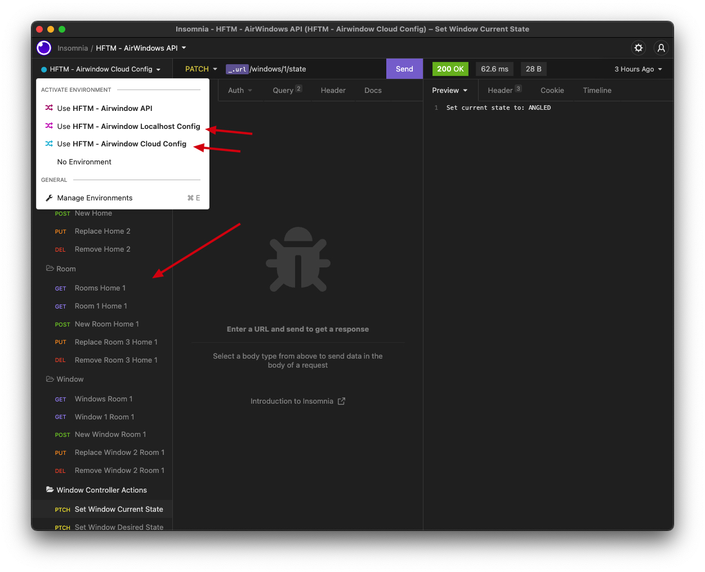

<div id="top"></div>
<!-- TEMPLATE SOURCE -->
<!-- 
*** This is a template to document a readme.
*** Not enough time to create one from scratch.
*** Credits to: https://github.com/othneildrew/Best-README-Template/blob/master/BLANK_README.md -->

<!-- PROJECT SHIELDS -->
<!--
*** I'm using markdown "reference style" links for readability.
*** Reference links are enclosed in brackets [ ] instead of parentheses ( ).
*** See the bottom of this document for the declaration of the reference variables
*** for contributors-url, forks-url, etc. This is an optional, concise syntax you may use.
*** https://www.markdownguide.org/basic-syntax/#reference-style-links
-->

[![Contributors][contributors-shield]][contributors-url]
[![Forks][forks-shield]][forks-url]
[![Stargazers][stars-shield]][stars-url]
[![Issues][issues-shield]][issues-url]
[![MIT License][license-shield]][license-url]
[![LinkedIn][linkedin-shield]][linkedin-url]

<!-- PROJECT LOGO -->
<br />
<div align="center">
  <a href="https://github.com/janbuettiker/airwindow-api">
    
  </a>

<h3 align="center">AirWindow API - Backend Service</h3>

  <p align="center">
    Airwindow is a product that allows you to remote control your Windows at home. ☁️   -powered with the help of this API. Don't laugh at my code, thanks for your consideration🌚
    <!--
    <br />
    <a href="https://github.com/janbuettiker/airwindow-api"><strong>Explore the docs »</strong></a>
    <br />
    <br />
    <a href="https://github.com/janbuettiker/airwindow-api">View Demo</a>
    ·
    <a href="https://github.com/janbuettiker/airwindow-api/issues">Report Bug</a>
    ·
    <a href="https://github.com/janbuettiker/airwindow-api/issues">Request Feature</a>
    -->
  </p>
</div>

<!-- TABLE OF CONTENTS -->
<details>
  <summary>Table of Contents</summary>
  <ol>
    <li>
      <a href="#about-the-project">About The Project</a>
      <ul>
        <li><a href="#api-endpoints">API Endpoints</a></li>
        <li><a href="#built-with">Built With</a></li>
      </ul>      
    </li>
    <li>
      <a href="#getting-started">Getting Started</a>
      <ul>
        <li><a href="#prerequisites">Prerequisites</a></li>
        <li><a href="#install-and-dev-mode">Install and Dev Mode</a></li>
        <li><a href="#run-docker-container-manually">Run Docker Container manually</a></li>
      </ul>
    </li>
    <li><a href="#usage">Usage</a></li>
    <li><a href="#roadmap">Roadmap</a></li>
    <li><a href="#contact">Contact</a></li>
  </ol>
</details>

<!-- ABOUT THE PROJECT -->

## About The Project

With the help of Quarkus, this api enables us to create a stateless API based on the REST architecture (as best as possible). The database is not really a topic that I will be able to cover as of now, so we will use H2 to run our database in memory within the same application container.

### API Endpoints

The api covers two kind of endpoints as of now

- APP Client - Used to build mobile applications. In our case, an android-native app.
- Window Controller - M5 Micro controller that needs state-access to its designated window.

#### APP Client

TODO: You will find out more soon!

#### Window Controller

The Window Controller is based off an M5Stamp Micro Controller.<br>
https://shop.m5stack.com/collections/m5-controllers/products/m5stamp-c3u-5pcs <br>
This micro controller will be programmed with the Arduino ESP32 platform. Thus we can follow this tutorial to try and programm necessary POST and GET requests to fullfill the requirements for the controller logic.<br>
https://randomnerdtutorials.com/esp32-http-get-post-arduino/

<p align="right">(<a href="#top">back to top</a>)</p>

### Built With

- [![Quarkus][quarkus]][quarkus-url]

<p align="right">(<a href="#top">back to top</a>)</p>

<!-- GETTING STARTED -->

## Getting Started

This service already runs in the cloud and is accessible through https://airwindow-api.jblabs.ch <br>
The service is not really persistent as of now, maybe not even accessible.
If you need to use it, contact me under jan.buettiker@hftm.ch

Or if this is just not necessary, here is a setup guide on how to run the api in dev mode locally.

### Prerequisites

- Docker
- Maven
- OpenJDK or other Java JDK

### Install and Dev Mode

1. Clone the repo
   ```sh
   git clone https://github.com/janbuettiker/airwindow-api.git
   ```
2. Start docker
3. Run

   ```sh
   ./mvnw quarkus:dev
   ```

4. Access the API under http://localhost:8080

5. Swagger-UI in dev mode http://localhost:8080/q/swagger-ui

### Run Docker Container manually

Of course, you could also run it as a docker container manually without dev services. <br>
Useful to debug problems locally and not through the cloud console.

If you don't have Java installed and only run docker, just download the image from docker hub.

```sh
docker pull janbuettiker/airwindow-api-jdk:latest
docker run -i --rm -p 8080:8080 janbuettiker/airwindow-api-jdk
```

Or if you have a Quarkus environment up and running

1. Package
   ```sh
   ./mvnw package
   ```
2. Docker build
   ```sh
   docker build -f src/main/docker/Dockerfile.jvm -t <username>/airwindow-api-jdk .
   ```
3. Docker run
   ```sh
   docker run -i --rm -p 8080:8080 janbuettiker/airwindow-api-jdk
   ```
4. Access the API under http://localhost:8080

<p align="right">(<a href="#top">back to top</a>)</p>

<!-- USAGE EXAMPLES -->

## Usage

Use this space to show useful examples of how a project can be used. Additional screenshots, code examples and demos work well in this space. You may also link to more resources.

For easiest use, import the Insomnia Workspace export.
This will include following goodies:

- Configured GET, POST, PATCH, DELETE requests
- Requests for Home, Room, Window and State resources
- Two environments with local url and cloud url config

1. Import the file found here: [Insomnia Export](_doc/insomnia/API-Doc-Export_2022-07-17.json) <br>
2. Install insomnia
   ```sh
   brew install insomnia
   ```
3. Import the JSON <br>
   <br>
   
4. Now you can access environment configurations (url) through the Workspace and use the imported requests to control the api.<br>
   

### GET - Window State

- URL: https://airwindow-api.jblabs.ch/windows/1/state?state=CURRENT
- Path: /windows/{id}/state - We only need the state for our window (in this case window with id 1)
- Query Params:
  - state - Which value is needed, desired or current states.

With this request, we can get following reply in plain text.
This should help to keep the Arduino implementation a simple as possible - no JSON body needed!

```text
# Current state of Window with ID 1
Current state: OPEN

# Desired state of Window with ID 1
Desired state: CLOSED
```

### POST - Window State

- URL: https://airwindow-api.jblabs.ch/windows/1/state?state=CURRENT&val=ANGLED
- Path: /windows/{id}/state - We only need the state for our window (in this case window with id 1)
- Query Params:
  - state - Which value is needed, desired or current states.
  - val - Value to override.

```text
# Set current state of Window with ID 1 to ANGLED
# https://airwindow-api.jblabs.ch/windows/1/state?state=CURRENT&val=ANGLED
Current state: OPEN

# Set desired state of Window with ID 1 to CLOSED
# https://airwindow-api.jblabs.ch/windows/1/state?state=DESIRED&val=CLOSED
Desired state: CLOSED
```

<p align="right">(<a href="#top">back to top</a>)</p>

<!-- ROADMAP -->

## Roadmap

- [ ] API KEY
- [ ] Persistent Datasource
- [ ] Error Handling and Validation
- [ ] Business Logic
  - [ ] 3rd Party Weather API

<p align="right">(<a href="#top">back to top</a>)</p>

<!-- CONTACT -->

## Contact

Jan Büttiker - [@buttikerjan](https://twitter.com/buttikerjan) - jan.buettiker@hftm.ch

Project Link: [https://github.com/janbuettiker/airwindow-api](https://github.com/janbuettiker/airwindow-api)

<p align="right">(<a href="#top">back to top</a>)</p>

<!-- MARKDOWN LINKS & IMAGES -->
<!-- https://www.markdownguide.org/basic-syntax/#reference-style-links -->

[contributors-shield]: https://img.shields.io/github/contributors/janbuettiker/airwindow-api.svg?style=for-the-badge
[contributors-url]: https://github.com/janbuettiker/airwindow-api/graphs/contributors
[forks-shield]: https://img.shields.io/github/forks/janbuettiker/airwindow-api.svg?style=for-the-badge
[forks-url]: https://github.com/janbuettiker/airwindow-api/network/members
[stars-shield]: https://img.shields.io/github/stars/janbuettiker/airwindow-api.svg?style=for-the-badge
[stars-url]: https://github.com/janbuettiker/airwindow-api/stargazers
[issues-shield]: https://img.shields.io/github/issues/janbuettiker/airwindow-api.svg?style=for-the-badge
[issues-url]: https://github.com/janbuettiker/airwindow-api/issues
[license-shield]: https://img.shields.io/github/license/janbuettiker/airwindow-api.svg?style=for-the-badge
[license-url]: https://github.com/janbuettiker/airwindow-api/blob/master/LICENSE.txt
[linkedin-shield]: https://img.shields.io/badge/-LinkedIn-black.svg?style=for-the-badge&logo=linkedin&colorB=555
[linkedin-url]: https://linkedin.com/in/linkedin_username
[product-screenshot]: images/screenshot.png
[quarkus]: https://design.jboss.org/quarkus/logo/final/PNG/quarkus_logo_horizontal_rgb_200px_reverse.png
[quarkus-url]: https://quarkus.io
